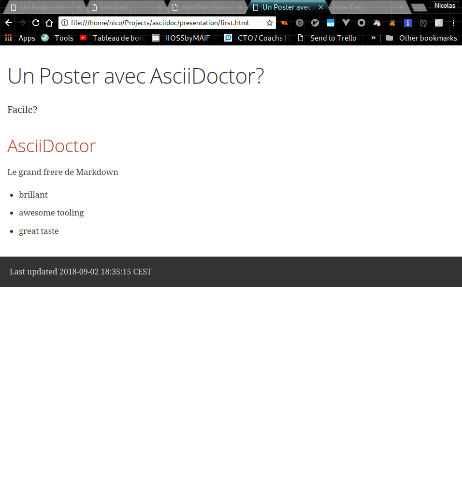

:source-highlighter: highlightjs
:icons: font

:customcss: "themes/mozilla-dark.css"

= Un Poster avec AsciiDoctor?

Facile?

== AsciiDoctor

Le grand frère de Markdown

Rendu automatiquement par github

[%step]
.Plein de format de sorti possible: 
* html
* man
* dockbook 
* pdf :-)
* revealJS (cette prez)
* bespokeJS
* etc...

== Un poster?

* Cheat Sheets :-)
- Tout le monde aime ca 
- C'est utile si c'est bien fait
- Ca fait g33k :)
- Ca coute moins chere qu'un poster Startup Vitamin !

* Shit Sheets :-(
- formats = png / jpg si on a de la change svg
- quel version? quand ca a été fait?
- la maintenance...
- la relecture... (github PR reviews...)

== Pourquoi ce talk alors?

Parce que Asciidoctor c'est cool !

.et pour introduire ces concepts:
- Boucle de feedback immediate
- Importance du tooling

[%notitle]
=== quote

[quote, Nicolas SAVOIS]
____
en 2018 la boucle de feedback immeditate c'est OBLIGATOIRE! +
Sinon tu donnes du temps de ta vie au dieu informatique qui n'en fera rien !
____

== T'es qui?

* Nicolas SAVOIS !
* Vieux Dev, + de 20 ans de code
* CTO @ Talanabs

Github : @savoisn +
Twitter : @nicosavois

== Donc une cheat sheet format poster !

Mon excuse pour apprendre AsciiDoctor

Une super experience

[NOTE.speaker]
--
Actually things aren't that bad
--

== Premier Document

[source, AsciiDoc]
----
include::first.adoc[]
----

.shell commande
[source, shell]
----
-> % asciidoctor first.adoc
-> % ls
first.adoc first.html
----

[%notitle]
=== le rendu

== Deeper in the markup language

[cols="50a,50a"]
|====
|
[source, AsciiDoc]
----
.block title
----
|====

